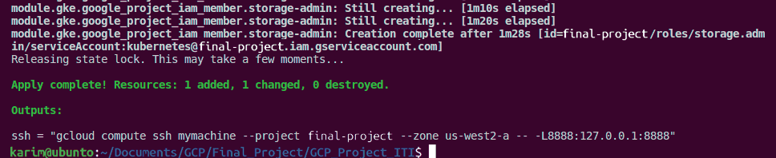

# Provision Private GKE cluster and Bastion Host on GCP Using Terraform
#### Deploy Python Application ![Project link] (https://github.com/atefhares/DevOps-Challenge-Demo-Code)
1. Docrize python web application using docker 
2. Pull redis image from docker Hub 
3. push 2 image to gcr on GCP
```
gcloud auth configure-docker gcr.io
docker tag web-app  gcr.io/final-project/python-app
docker push gcr.io/final-project/python-app

docker tag redis gcr.io/final-project/redis
docker push gcr.io/final-project/redis

```
# Infrastructure Resoureces on GCP
1. Make backend configuration using GCP Bucket
2. Create VPC
* subnets (management subnet & restricted subnet)
* Management subnet has the (NAT gateway , Private vm)
* Restricted subnet has the (Private standard GKE cluster (private control plan))
Notes:
1. Restricted subnet must not have access to internet
2. All images deployed on GKE must come from GCR or Artifacts registry.
3. The VM must be private.
4. Deployment must be exposed to public internet with a public HTTP load balancer.
5. All infra is to be created on GCP using terraform.
6. Deployment on GKE can be done by terraform or manually by kubectl tool.
7. Don’t use default compute service account while creating the gke cluster, create
custom SA and attach it to your nodes.
8. Only the management subnet can connect to the gke cluster.

# To run Terraform code
```
terraform init
terraform plan --var-file variables.tfvars 
terraform plan --var-file variables.tfvars
```
  

# authenticate with the cluster
```
gcloud container clusters get-credentials mycluster --zone us-west2-a --project final-project
```
```
gcloud compute ssh mymachine --project final-project --zone us-west2-a -- -L8888:localhost:8888
```
#### Run Kubectl using this command or do export
```
HTTPS_PROXY=localhost:8888 kubectl
## or use 
export HTTPS_PROXY=localhost:8888
kubectl
```

## Deploy Kuberentes Files
```
kubectl apply -fR ./kubernetes
```
```
kubectl get ingress
```

### Finally Destroy Infrastructur
```
terraform destroy --var-file variables.tfvars
```

